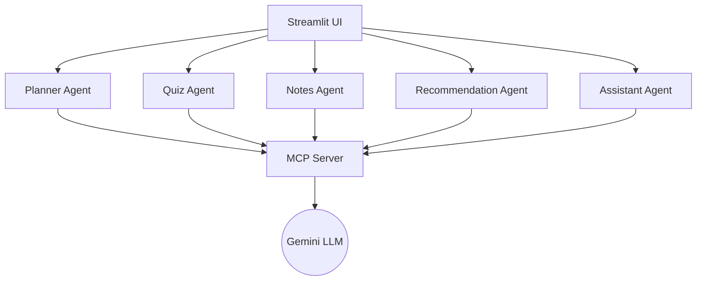
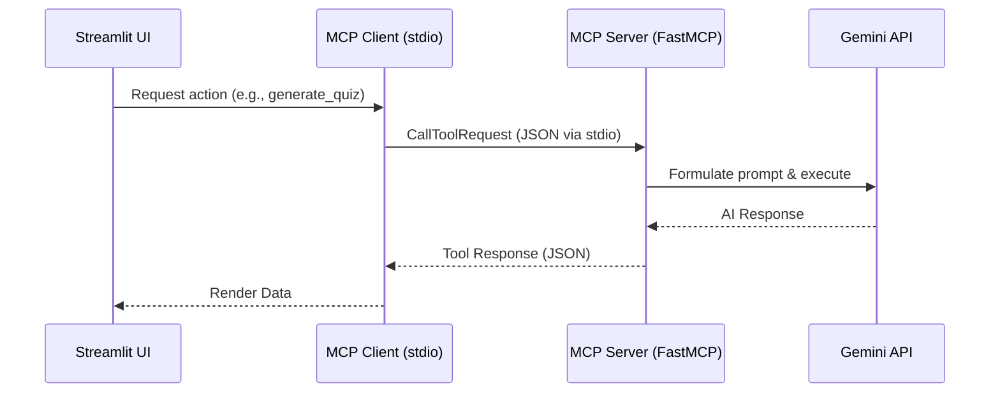
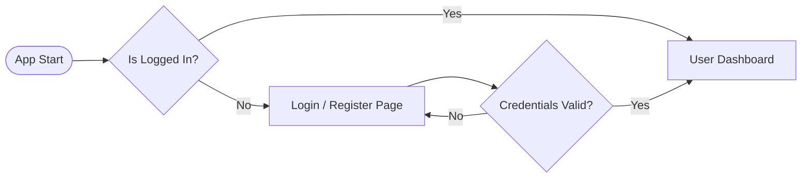
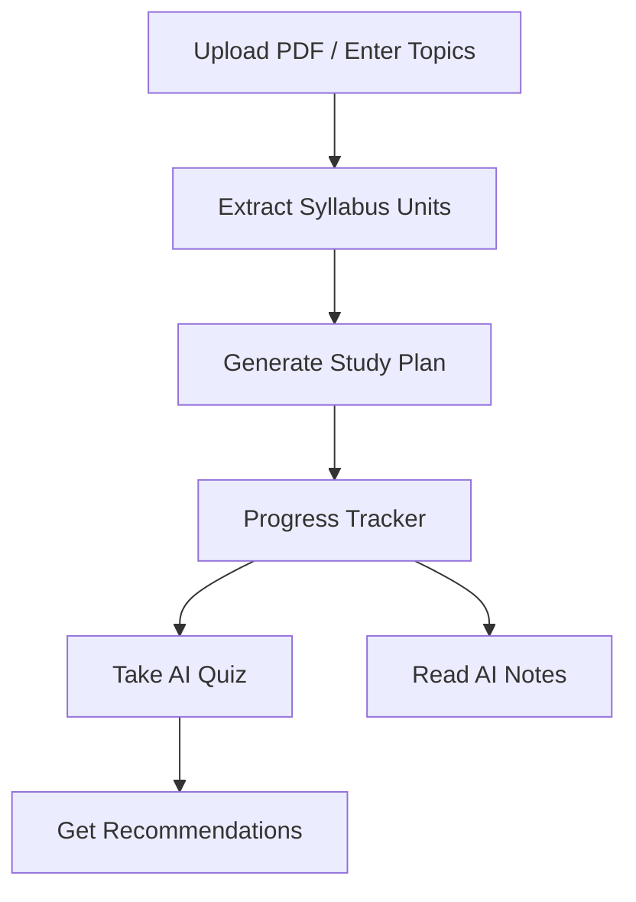

# 🎓 AI Student Study Planner


A powerful, multi-agent AI study planner that transforms static syllabuses into interactive, personalized learning journeys.

---

## 🚀 1. Problem Statement
Students often struggle with organizing their study schedules, extracting relevant information from dense syllabuses, and finding targeted practice materials. Traditional planners are static and fail to adapt to a student's ongoing progress, weaknesses, or upcoming exam deadlines.

## 💡 2. Solution Overview
The **AI Student Study Planner** leverages advanced LLMs (Google Gemini) and a Multi-Agent architecture to dynamically generate study plans, interactive quizzes, tailored study notes, and smart recommendations. By integrating the **Model Context Protocol (MCP)**, the application seamlessly decouples frontend UI from backend AI execution, ensuring a robust, scalable, and highly interactive learning experience.

## ✨ 3. Key Features
- **User Authentication:** Secure login and profile management with personalized dashboards.
- **Dynamic Study Planner:** Automatically extracts topics from uploaded PDF syllabuses or manual entry and generates day-by-day study schedules.
- **AI Quiz Generator:** Generates topic-specific quizzes (MCQs and short answers) to test knowledge.
- **AI Notes Generator:** Creates detailed, customized study notes for complex topics on demand.
- **Progress Tracking:** Interactive dashboard to mark completed topics and visualize study progress.
- **Smart Recommendations:** Context-aware suggestions based on remaining days to the exam and completed topics.
- **AI Study Assistant:** A conversational tutor that understands the student's exact syllabus and current progress.
- **MCP Developer Panel:** Real-time visibility into official MCP tool executions, connections, and fallbacks.

## 🛠️ 4. Technologies Used
- **Frontend/UI:** [Streamlit](https://streamlit.io/)
- **Backend/AI:** Python, Google GenAI SDK (Gemini 2.5 Flash)
- **Architecture:** Official [Model Context Protocol (MCP)](https://modelcontextprotocol.io/) via `mcp` SDK
- **Data Storage:** Local JSON storage (`storage.py`)
- **PDF Processing:** PyPDF2

---

## 🏗️ 5. Multi-Agent Architecture
The application uses a specialized multi-agent system where different "agents" handle distinct educational tasks.



---

## 🔌 6. Official MCP Architecture
We natively integrate the official Model Context Protocol (MCP) to decouple the AI orchestration from the frontend.


**Robust Fallback:** If the external MCP subprocess fails, the agents automatically intercept the failure and seamlessly execute the local fallback implementation, ensuring zero UI crashes.

---

## 🔐 7. Authentication Flow


---

## 📅 8. Study Plan Workflow


---

## 🧠 9. AI Workflow
1. **Context Aggregation:** Agents pull user profiles, active study plans, and topic progress.
2. **Prompt Injection:** Context is dynamically injected into system instructions.
3. **Execution:** Sent via MCP to the LLM.
4. **Validation:** JSON responses are parsed and validated before reaching the frontend.

---

## 📁 10. Folder Structure
```text
study_planner_agent/
│
├── app.py                      # Main Streamlit Application UI
├── requirements.txt            # Python dependencies
├── .env.example                # Environment variables template
├── README.md                   # Project documentation
│
├── agents/                     # Agent implementations (MCP Clients)
│   ├── assistant_agent.py      # Conversational Tutor
│   ├── notes_agent.py          # AI Study Notes
│   ├── planner_agent.py        # Study Schedule Generator
│   ├── quiz_agent.py           # Educational Assessments
│   └── recommendation_agent.py # Smart Suggestions
│
├── utils/                      # Core infrastructure
│   ├── mcp_client.py           # Subprocess Dispatcher & Fallback Logic
│   ├── mcp_server.py           # Official FastMCP Tool Registry
│   ├── gemini_helper.py        # LLM Interface
│   └── storage.py              # User Data Management
│
└── data/                       # Local JSON storage (Profiles, MCP Logs, etc.)
```

---

## 🚀 11. Installation Steps
1. **Clone the repository:**
   ```bash
   git clone https://github.com/yourusername/ai-study-planner.git
   cd ai-study-planner
   ```

2. **Create a Virtual Environment:**
   ```bash
   python -m venv venv
   # Windows:
   venv\Scripts\activate
   # macOS/Linux:
   source venv/bin/activate
   ```

3. **Install Dependencies:**
   ```bash
   pip install -r requirements.txt
   ```

---

## ⚙️ 12. Running the Project
```bash
streamlit run app.py
```
*Open the provided Local URL (e.g., `http://localhost:8501`) in your browser.*

---

## 🔑 13. Environment Variables
Copy the `.env.example` file to `.env` and configure your API key.

```bash
cp .env.example .env
```
Inside `.env`:
```env
GEMINI_API_KEY=your_actual_gemini_api_key_here
```
*(If no API key is provided, the system gracefully falls back to a mock mode for demonstrations.)*

---

## 📸 14. Screenshots

| Dashboard | Study Planner |
|:---:|:---:|
| *(Placeholder for Dashboard Screenshot)* | *(Placeholder for Planner Screenshot)* |

| MCP Developer Panel | AI Quiz Generator |
|:---:|:---:|
| *(Placeholder for MCP Panel Screenshot)* | *(Placeholder for Quiz Screenshot)* |

---

## 🔮 15. Future Enhancements
- **Multi-modal Inputs:** Allow uploading images of handwritten notes or textbooks.
- **Flashcard Export:** Direct export of quizzes to Anki or Quizlet.
- **Community Sharing:** Share customized study plans with classmates.
- **RAG Integration:** Deep semantic search across large course textbooks using Vector Databases.

---

## 👥 16. Contributors
- [Your Name/Team Name] - *Lead Developer*

---

## 📄 17. License
This project is licensed under the MIT License - see the LICENSE file for details.


## 🌐 Live Demo
*Application Link:https://ai-study-planner-agent-vvyfxxp3q59oy87l3mavzr.streamlit.app/
